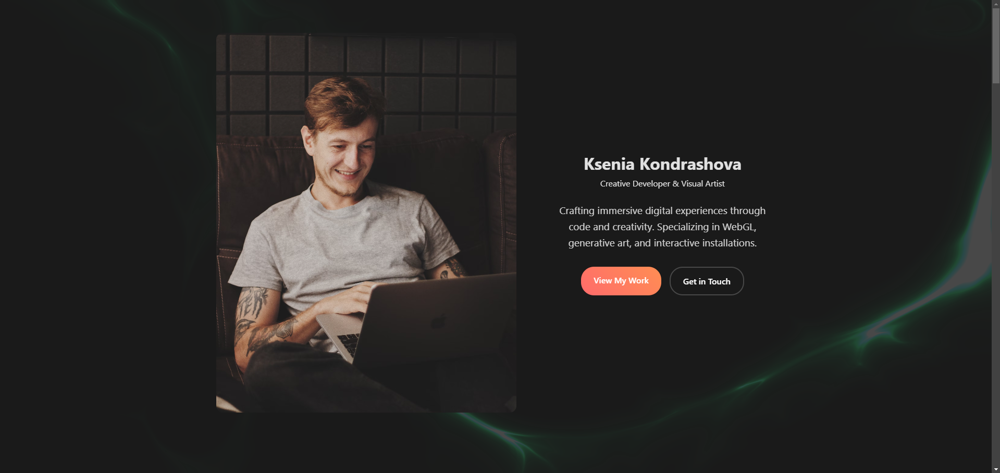

# Neural-Noice


A sophisticated portfolio platform leveraging modern web technologies to create an immersive user experience, featuring:
- Responsive design architecture
- Intelligent theme switching system
- Dynamic project visualization
- Interactive skill progression tracking
- Content management system with blog integration
- Chronological experience timeline
- Secure contact interface
- Modern animations and transitions



## Technology Stack
- HTML5 with semantic markup
- CSS3 (Modern layouts with CSS Grid, Flexbox, Custom Properties)
- Vanilla JavaScript (ES6+)
- HTML5 Canvas for dynamic backgrounds

## Core Features
- Mobile-first responsive architecture
- Seamless theme transition system
- Interactive project portfolio with advanced hover states
- Dynamic skill visualization
- Rich content presentation through blog interface
- Interactive timeline visualization
- Validated contact form with real-time feedback
- Comprehensive social media integration
- Modular footer architecture

## Quick Start
1. Clone the repository

```bash
git clone https://github.com/your-username/neural-noice.git
```

2. Navigate to the project directory and open `index.html` in your preferred browser

## Project Architecture
```
neural-noice/
├── index.html
├── assets/
│   ├── images/
│   └── icons/
├── css/
│   └── styles.css
├── js/
│   ├── main.js
│   └── canvas.js
└── README.md
```

## Key Components
- `index.html`: Core application entry point
- `styles.css`: Modular styling system
- `main.js`: Core functionality and interactions
- `canvas.js`: Background animation controller

## Contributing
Contributions are welcome! Please follow these steps:
1. Fork the repository
2. Create a feature branch (`git checkout -b feature/AmazingFeature`)
3. Commit your changes (`git commit -m 'Add some AmazingFeature'`)
4. Push to the branch (`git push origin feature/AmazingFeature`)
5. Open a Pull Request

## License
This project is licensed under the [MIT License](https://choosealicense.com/licenses/mit/)